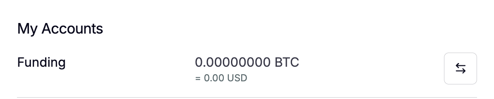

# Accounts

## Accounts & Balances

The **Twilight Wallet** is the central dashboard for managing your balances and accounts across two layers — the **Funding Account** on the Cosmos-based Nyks chain, and one or more **Trading Accounts** on the privacy layer (zkOS).

This structure allows you to control public and private balances independently, while trading with full privacy.

***

### Account Layers Overview

| Account Type        | Network                 | Description                                                                                                                                            |
| ------------------- | ----------------------- | ------------------------------------------------------------------------------------------------------------------------------------------------------ |
| **Funding Account** | Nyks Chain (Cosmos SDK) | A transparent, on-chain account holding NYKS and SATs test tokens. Used for deposits, withdrawals, and cross-chain transfers.                          |
| **Trading Account** | zkOS Layer              | A shielded sub-account used to open and manage perpetual trading positions. Balances and PnL are encrypted and verified through zero-knowledge proofs. |

Each **Funding Account** can be linked to multiple **Trading Accounts**.\
This enables you to manage separate trading strategies, risk profiles, or automated bots under one wallet identity.

***

### How It Works

1. **Keplr** connects to the Nyks chain, where your Funding Account resides.
2. When you transfer assets from the Funding Account to a Trading Account, they are deposited into zkOS — becoming private and shielded.
3. zkOS validates all trades and margin updates using zero-knowledge proofs, without ever revealing individual positions.
4. Withdrawals from zkOS move funds back into the Funding Account for visibility on Nyks or for further transactions.

> 💡 You can think of the Funding Account as your “public gateway” and the Trading Accounts as your “private vaults” inside Twilight.

***

### Using the Wallet Dashboard

The **Wallet page** in the Twilight frontend acts as your control panel:

* **View balances** across both Funding and Trading layers.
* **Create new trading accounts** for isolated margin management.
* **Transfer funds** between Funding and Trading accounts.
* **Monitor open positions** linked to each trading account.

<figure><figcaption></figcaption></figure>

All transactions are signed through your connected Keplr wallet, ensuring full custody of funds.

***

### Example Workflow

1. Connect your Keplr wallet.
2. Deposit testBTC or NYKS into your Funding Account.
3. From the Wallet page, click on the bi-directional arrow icon on the Funding Account&#x20;

<figure><figcaption></figcaption></figure>

4. Transfer funds from the Funding Account to the new Trading Account.

<figure><figcaption></figcaption></figure>

5. Use that account to open perpetual trades privately on the exchange.

Each Trading Account maintains:

* Its own margin and open positions.
* Separate liquidation and risk parameters.
* An independent zk-proof record for privacy.

***

### &#x20;Privacy and Transparency

* Balances inside zkOS remain fully **encrypted** — neither other users nor validators can see them.
* Only zk-proofs are published to Nyks, ensuring transparent validation without exposing user data.
* Funding Account balances remain visible for interoperability, bridging, and reward distribution.

***
