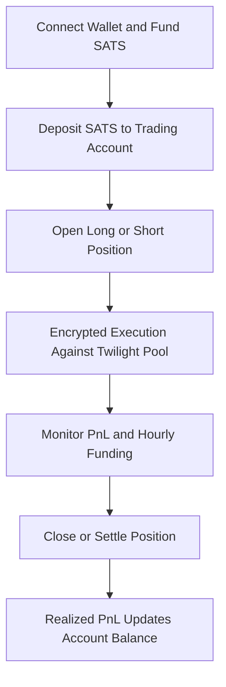

# How to Trade on Twilight

> **Audience:** New users exploring the Twilight Testnet\
> **Goal:** Understand how trading works on Twilight and prepare to begin your journey as a trader or liquidity provider.

***

### Trading on Twilight — A New Kind of Exchange

Trading on Twilight isn’t just about opening a position — it’s about participating in a **Bitcoin-first, privacy-preserving perpetual exchange**.\
Every trade interacts directly with the **Twilight Pool**, a shared liquidity layer backed by BTC collateral, where profits and losses settle automatically without revealing your position to anyone else.

Unlike conventional perpetual DEXs:

* There is **no AMM** and **no public order book**.
* Trades execute at the **oracle spot price** (currently Binance mid).
* There are **no interest costs** — funding is used solely to balance exposure between longs and shorts.
* All positions are **encrypted using zkOS**, ensuring your margin, leverage, and PnL remain private while the system stays publicly verifiable.

***

### The Building Blocks of a Trade

Before you place your first trade, it helps to understand the main components of the Twilight trading system:

| Component                | Description                                                                                                                                                             |
| ------------------------ | ----------------------------------------------------------------------------------------------------------------------------------------------------------------------- |
| **Collateral**           | All trades use **SATS**, a Bitcoin-denominated test asset. SATS represent BTC in the testnet environment and are distributed freely via faucet.                         |
| **Twilight Pool**        | The shared BTC liquidity pool that acts as the counterparty to all trader positions. LPs deposit collateral; traders open leveraged long or short positions against it. |
| **Privacy Layer (zkOS)** | Ensures that individual trade data — such as margin, leverage, and PnL — remains encrypted on-chain while still verifiable by validators.                               |
| **Funding Mechanism**    | An hourly funding rate based on position skew balances long and short exposure within the pool.                                                                         |
| **Settlement**           | Each trade is isolated, meaning losses cannot exceed your posted margin. Realized PnL flows back to your trading account when positions close.                          |

***

### Trading Flow Overview

Every trade on Twilight follows a simple and verifiable lifecycle:

Each position you open is:

* Private: encrypted end-to-end using zkOS.
* Independent: isolated margin ensures no cross-position contagion.
* On-chain verifiable: settlements and pool accounting are confirmed at the block level.

***

### Start Exploring

You’re now ready to begin your journey through the Twilight Testnet.

Follow these next steps to set up your environment and start trading:

* [Connect & Fund Your Wallet](connect-and-fund-your-wallet.md)
* [Understand Accounts & Balances](accounts.md)
* [Provide Liquidity (Optional)](providing-liquidity.md)
* [Troubleshooting & FAQs](../)

> Note: All activity on the Twilight Testnet uses test tokens (SATS) — they carry _no real monetary value_.
>
> The goal is to familiarize yourself with the Twilight platform before the mainnet launch.

***
