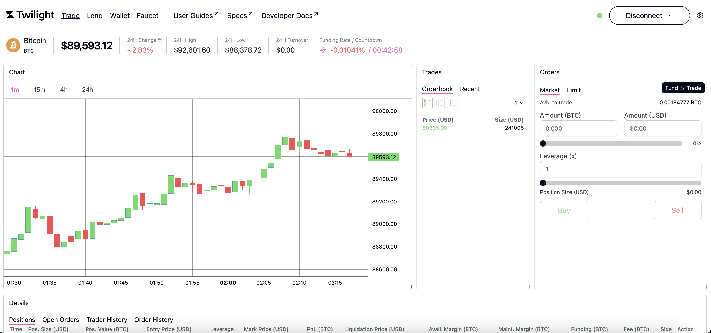

# Making a Trade

Once your wallet is connected and your trading account funded, you’re ready to open your first position on the **Twilight Perpetual Exchange**.

Twilight’s exchange is designed for **basis-free, privacy-preserving perpetual trading** — meaning you can open leveraged long or short positions without paying ongoing funding costs, while keeping your PnL fully encrypted.

***

### Pre-Trade Requirements

Before trading, ensure that:

* Your **Keplr wallet** is connected to the Twilight Testnet.
* You’ve funded a **Trading Account** via the Wallet page.
* You hold enough NYKS for gas fees (transactions are signed via Keplr).
* You have been verified (you will be  prompted to do so before your first trade). Please see [zk-region-verification.md](zk-region-verification.md "mention")for more details.

> 💡 All trades are executed through your Trading Account on zkOS — balances, PnL, and liquidation status are private and verifiable through zero-knowledge proofs.

***

### Trading Interface Overview

The **Trading page** allows you to:

* View available perpetual pairs (e.g., BTC/USDT).
* Check current mark price and 24h stats.
* Open **Long** or **Short** positions.
* Monitor active trades and realized PnL privately.

<figure><figcaption></figcaption></figure>

Each trade interacts with the **Twilight Pool**, not an order book.\
Liquidity providers back the pool, and all trades are settled directly against it — this design eliminates traditional matching, reduces slippage, and ensures deterministic settlement.

***

### Opening a Position

1. Navigate to the **Trade** page on the frontend:\
   [https://frontend.twilight.rest/trade](https://frontend.twilight.rest/trade)
2. Select in the Orders form for **Market Order** or **Limit Order.**

<figure><figcaption></figcaption></figure>

<figure><figcaption></figcaption></figure>

3. Enter your trade size (in BTC) and desired leverage.
4. Review position summary — collateral, liquidation price, and PnL are shown privately.
5. Click **Buy** to go long or **Sell to go short**.
6. Approve the transaction (only if needed).

Once confirmed:

* Your collateral is committed from your Trading Account.
* The position is registered privately in zkOS.
* Settlement occurs directly against the Twilight Pool.

***

### Order and Position Details

The Details Card is where you will find all the information on all current and past orders and positions.

If you opened a limit position that has not been filled, you can monitor and adjust it from the **Open Orders** tab.

<figure><figcaption></figcaption></figure>

If your position has been filled, you can view the **Positions** tab to see your active positions.

<figure><figcaption></figcaption></figure>

Both open orders (marked as pending) and filled orders can be found in the Order History tab.

<figure><figcaption></figcaption></figure>

#### View Details

You can view the following details of your orders, updated in real time:

* **Entry Price** – average execution price.
* **Mark Price** – current reference price.
* **Collateral Used** – margin held in zkOS.
* **PnL (Private)** – encrypted until settlement.
* **Health Ratio** – liquidation threshold indicator.

#### Adjust or Close

* **Close Market** – Close the position at the market price, usually executed immediately.&#x20;
* **Close Limit** – Close the position at a certain price. For long positions, Twilight will attempt to close the position at a price that is equal to or above the limit price set.

After closing a position, you will receive confirmation dialogs. You can also check the **Trade History** tab to see a history of all the completed trades.

<figure><figcaption></figcaption></figure>

> ⚠️ When your health ratio drops below the minimum threshold, the position becomes eligible for liquidation.\
> Liquidations are verified cryptographically via zk-proofs to prevent false triggers.

***

### Settlement and PnL Privacy

Twilight’s unique settlement system ensures:

* **PnL remains private** while the network verifies that gains/losses are correct.
* **No funding rate volatility** — traders don’t pay or earn periodic funding fees.
* **Liquidation events** are publicly provable but don’t expose user positions.

All settlements occur directly against the Twilight Pool, ensuring continuous liquidity for both traders and LPs.

***

### Example Trade Flow

| Step | Action                           | Layer       | Description                                   |
| ---- | -------------------------------- | ----------- | --------------------------------------------- |
| 1    | Deposit BTC into Trading Account | Nyks → zkOS | Convert public BTC to shielded collateral     |
| 2    | Open Long 2x on BTC/USDT         | zkOS        | Position created privately, collateral locked |
| 3    | Twilight Pool adjusts exposure   | zkOS + Pool | Trade settled directly against pool           |
| 4    | Close position                   | zkOS        | PnL calculated privately, verified on-chain   |
| 5    | Withdraw profits                 | zkOS → Nyks | Encrypted balance withdrawn to public account |

> 📘 _Twilight supports multiple position types and leverage configurations, depending on market conditions. For a detailed overview of trading mechanics, pricing, and liquidation rules, see the Exchange Mechanics section._

***

### Security Notes

* Twilight enforces non-custodial trading — all positions are owned and signed by the user.
* zk-proofs guarantee integrity of settlements and liquidation logic.
* Private balance verification prevents manipulation or MEV-based attacks.

***
