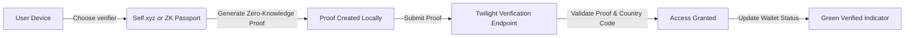

# ZK Region Verification

## Zero-Knowledge Region Verification

> **Audience:** Testnet users (optional), Mainnet users (mandatory)\
> **Goal:** Understand and complete region verification using zero-knowledge proofs through **Self** or **ZK Passport** identity providers.

***

### Why Region Verification Matters

Twilight uses **zero-knowledge region verification** to meet regulatory requirements while preserving user privacy. 

Instead of submitting documents or identity data, users prove—cryptographically—that their passport was issued by a supported APAC country.

No personal details, images, or identity records ever leave your device.

***

### Verification Requirements

| Network     | Requirement | Description                                                                                    |
| ----------- | ----------- | ---------------------------------------------------------------------------------------------- |
| **Testnet** | Optional    | Completing region verification earns **bonus points** and **eligibility for airdrop rewards**. |
| **Mainnet** | Mandatory   | Only users verified from supported APAC countries can trade or provide liquidity.              |

> Each Twilight address must be verified independently.\
> The indicator at the top-right turns green once verification is complete.

***

### Supported Verifiers

You can verify your region using either of the following **zero-knowledge identity providers**:

| Provider        | Description                                                                                                                  |
| --------------- | ---------------------------------------------------------------------------------------------------------------------------- |
| **Self.xyz**    | A privacy-first identity wallet that lets you prove nationality using cryptographic credentials from your device.            |
| **ZK Passport** | A decentralized passport verifier using ZK proofs to confirm your country of citizenship without exposing any personal data. |

Both methods issue a non-reversible proof token bound to your Twilight address.

***

### Supported Countries (APAC Region)

Twilight currently supports passports issued by the following countries:

> China (CN), Indonesia (ID), Japan (JP), South Korea (KR), Mongolia (MN), Malaysia (MY),\
> Nepal (NP), Singapore (SG), Thailand (TH), Turkmenistan (TM), Uzbekistan (UZ), Vietnam (VN),\
> Australia (AU), New Zealand (NZ), Bangladesh (BD), India (IN), Kazakhstan (KZ),\
> Maldives (MV), Philippines (PH), Tajikistan (TJ), Taiwan (TW)

***

### Step-by-Step Verification Guide

#### 1. Access the Verification Page

Look for the **region verification indicator** in the top-right banner of the Twilight interface. &#x20;

&#x20;  — When **red**, it means your address has **not yet been verified**. &#x20;

&#x20;  — Click the indicator to open the **Region Verification page**, which provides full step-by-step instructions. &#x20;

&#x20;  — Once verification is complete, the indicator turns **green**. &#x20;

If your indicator is already **green**, clicking it will simply display a confirmation message and return you to the main dashboard.

#### 2. Choose Your Verification Method

You’ll be prompted to select between:

* **Self.xyz**
* **ZK Passport**

Choose the provider you prefer.

#### 3. Scan the QR Code

If using **Self.xyz**:

1. Open the **Self** app on your mobile device.
2. Scan the **QR code** shown on the page.
3. Follow the on-screen instructions in the app to verify your passport country.
4. Keep the Twilight tab open until verification completes.

If using **ZK Passport**, follow the same process through the ZK Passport app.

#### 4. Confirmation

When verification succeeds:

* The **red indicator** changes to green.
* Your Twilight address is tagged as region-verified.
* You can proceed to trading, or providing liquidity.

> ⚠️ Verification is tied to each address or subaccount. Repeat if you use multiple addresses.

***

### Notes & Troubleshooting

| Issue                                   | Possible Cause / Fix                                                                              |
| --------------------------------------- | ------------------------------------------------------------------------------------------------- |
| **QR code doesn’t scan**                | Refresh the page and retry. Ensure your phone camera or app supports QR scanning.                 |
| **Verification not completing**         | Keep the verification page open during the process; closing or refreshing interrupts it.          |
| **Unsupported country**                 | Twilight currently only verifies passports from supported APAC countries.                         |
| **Indicator still red after verifying** | Wait a few minutes or reconnect your wallet. The frontend will refresh your status automatically. |

***

### Privacy Commitment

Twilight’s region verification system is **fully privacy-preserving**:

* Only a cryptographic country proof is stored.
* No document or images ever leave your device.
* Proofs are one-way and non-reversible.

This ensures compliance with future regional access requirements — without compromising the core principle of **user privacy**.

***
