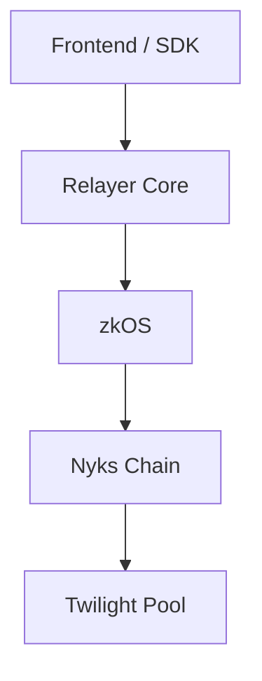
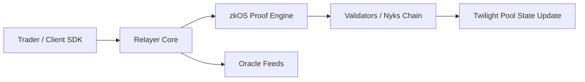

# Architecture Overview

Twilight’s architecture is built to make Bitcoin-native perpetual trading verifiable, private, and non-custodial — without relying on opaque intermediaries or wrapped assets.

It achieves this through a three-layer design that separates execution, settlement, and privacy, ensuring each layer can evolve independently while maintaining full cryptographic integrity.

***

#### Architecture at a Glance

This flow represents the end-to-end lifecycle of a trade on Twilight — from a user submitting an encrypted order via the SDK or web frontend, through private proof generation in the zkOS layer, to on-chain verification and settlement on the Nyks Chain.

Each layer contributes a distinct function:

* Frontend / SDK: User interface and signing environment
* Relayer Core: Execution and risk management engine
* zkOS Privacy Engine: Generates zero-knowledge proofs to shield margin and position data
* Nyks Chain: Consensus and settlement, maintaining verifiable global state
* Twilight Pool: The on-chain BTC collateral base that backs all positions

### 1. System Design Philosophy

Traditional exchanges blend execution, custody, and clearing into a single opaque process.

Twilight unbundles these layers and rebuilds them with verifiable logic:

* Execution is handled by a deterministic relayer and validated by consensus.
* Custody remains fully non-custodial — BTC collateral is represented as on-chain SATS (testnet) or Boomerang-bridged BTC (mainnet).
* Privacy is native, powered by zkOS and Bulletproofs, not a bolt-on feature.

This separation enables institutional-grade composability: traders interact through proofs, liquidity providers manage collateral transparently, and validators confirm correctness without learning private data.

***

#### 1) 2. Core Components

#### Nyks Chain (Consensus & Settlement Layer)

* Built on Cosmos SDK, optimized for shielded, Bitcoin-denominated DeFi applications.
* Anchors all state transitions, validator signatures, and proof verifications.
* Maintains public metrics (TVL, utilization, funding rate, block-level settlement events).
* Integrates with zkOS for shielded UTXO updates during trade settlement.

In essence, Nyks acts as the final settlement ledger — public enough to be auditable, private enough to protect market integrity.

***

#### zkOS (Privacy & Proof Layer)

* A UTXO-based operating system that shields account balances and trading state.
* Uses Bulletproofs to prove correctness of balances, leverage, and settlement without revealing underlying values.
* Client SDK and relayer handle proof generation and submission automatically; validators only see commitments and validity flags.
* Enables private margin accounting while maintaining verifiable pool solvency.

zkOS is what transforms Twilight from a “DEX” into a verifiable black box — everyone can audit that it works, no one can see _how_ positions are distributed.

***

#### Relayer Core (Execution & Risk Engine)

* Executes trades directly against the Twilight Pool, not a public orderbook.
* References external spot feeds (currently Binance mid) to determine execution price.
* Applies hourly funding adjustments based on open interest skew.
* Enforces margin validation, liquidation checks, and utilization throttles before committing trades to chain.
* Emits finalized settlement proofs to validators for block inclusion.

The relayer is stateless in custody terms — it never holds user funds — but stateful in risk logic. It acts as the protocol’s execution referee.

***

#### Twilight Pool (Liquidity Layer)

* A single-asset BTC pool that acts as the economic counterparty to all perpetual positions.
* LPs deposit BTC (testnet SATS) and earn returns from trader PnL, fees, and funding flows.
* Utilization (U = TTM / TVL) defines the pool’s capacity to absorb new exposure.
* No AMM curves, no impermanent loss, and no secondary tokenized pool shares — everything is tracked internally and marked in BTC units.

By centralizing liquidity and decentralizing execution, Twilight ensures that depth is real (BTC-backed) and that liquidations never cascade beyond posted margin.

***

### 3. Data & Proof Flow

1. The trader submits a shielded order via the SDK.
2. The relayer validates margin, prices it at the oracle mark, and calls zkOS to build proofs.
3. The resulting transaction and proof are broadcast to validators.
4. Validators verify and settle the transaction on the Nyks chain.
5. Pool NAV and utilization update, producing new public metrics.

This pipeline ensures every trade is atomic, auditable, and privacy-preserving — from proof generation to block confirmation.

***

### 4. Security & Trust Model

* Validators verify correctness, not visibility — they see cryptographic proofs, not user balances.
* Relayer enforces deterministic checks; it can be replaced or distributed without breaking state integrity.
* Liquidity providers retain custody; withdrawals remain permissionless and verifiable.
* No custodial bridge exposure: Boomerang (mainnet) will handle BTC wrapping with multi-sig and EigenLayer-secured operators.

***

### 5. The Twilight Economic Loop

Twilight’s layered design forms a closed, verifiable economic loop:

* BTC collateral fuels liquidity,
* zkOS shields participant data,
* Nyks enforces consensus and settlement,
* the Relayer orchestrates execution and risk,
* and the Pool closes PnL back into its own NAV.

Every layer is independently auditable yet cryptographically interlocked — ensuring privacy for users, solvency for the system, and transparency for the network.
