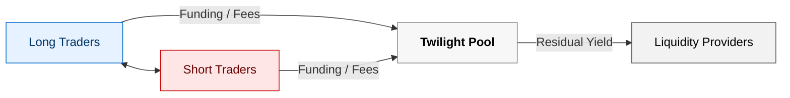

# Fees & Funding

> Audience: Traders, Market Makers, and Liquidity Providers
>
> Goal: Understand how trade fees and funding rates operate within Twilight’s oracle-priced perpetual exchange.

***

### 1. Overview

Every trade on Twilight interacts directly with the pooled BTC collateral, and all economic flows — fees, funding, and liquidation proceeds — accrue to or deduct from the pool’s Net Asset Value (NAV).

Twilight’s fee and funding structure is designed to:

* Reward liquidity providers for backing trader exposure,
* Discourage one-sided positioning through funding incentives, and
* Maintain an interest-free environment for all leveraged positions.

There are no protocol fees, treasuries, or insurance allocations in the current testnet; all flows remain internal to the pool.

***

### 2. Trade Fees

Twilight applies simple and transparent trade fees based on execution type.

Fees are denominated in BTC (SATS) and automatically deducted from margin balances at fill.

| Fill Type | How Determined                                                  | Fee Rate                  | Flow Destination |
| --------- | --------------------------------------------------------------- | ------------------------- | ---------------- |
| Taker     | Market orders or limits that cross the oracle price immediately | 0.04% (4 bps) of notional | 100% to pool NAV |
| Maker     | Limit orders that trigger later when oracle reaches your price  | 0.02% (2 bps) of notional | 100% to pool NAV |

*   Maker / Taker Logic:

    Maker status depends purely on execution behavior, not on a residency score or on-chain ranking.

    Future iterations will expand maker eligibility to include liquidity stability and top-up responsiveness.
*   Fee Currency:

    Fees are debited in BTC (SATS) and credited directly to the pool NAV at execution.
*   Interest-Free Leverage:

    There is no margin interest or borrowing cost — leverage is provided natively by the pool, and fees are the only per-trade cost.

***

### 3. Funding Rate

Funding in Twilight is not a mark-to-spot mechanism — prices already follow the external oracle.

Instead, funding functions as a skew-compensation mechanism that balances long and short exposure across the system.

#### Purpose

Funding transfers discourage directional imbalance (e.g., too many longs vs. shorts) and compensate liquidity providers for the risk of skewed inventory.

#### Interval

* Frequency: Hourly
* Accrual: Continuous
* Settlement: At position close or liquidation

***

### 4. Formula

Twilight computes the hourly funding rate as follows:

```
skew_raw = (L_usd - S_usd) / (L_usd + S_usd) # -1 .. +1 
rate_hr = (skew_raw * skew_raw) / (psi * 8) # unsigned 
rate_hr = rate_hr * sign(skew_raw) # apply direction
```

| Variable | Description                                        |
| -------- | -------------------------------------------------- |
| L\_usd   | Total notional of all long positions               |
| S\_usd   | Total notional of all short positions              |
| psi      | Governance-tunable scalar (currently 1 in testnet) |
| rate\_hr | Hourly funding rate applied to each position       |

***

### 5. Funding Direction

Funding flows are applied per position based on the current skew:

| Market Condition    | Payer      | Receiver       | Residual             |
| ------------------- | ---------- | -------------- | -------------------- |
| Long-heavy (L > S)  | Longs pay  | Shorts receive | Residual to Pool NAV |
| Short-heavy (S > L) | Shorts pay | Longs receive  | Residual to Pool NAV |

This residual ensures that aggregate funding always closes into the pool, contributing directly to LP yield.

***

### 6. Application Basis

Funding is applied to margin balances, not to total notional.

Each open position accrues funding continuously and settles once — either when the position closes voluntarily or is liquidated.

Mathematically:

```
funding_pos_usd = position_notional_usd * rate_hr
funding_pos_btc = funding_pos_usd / mark_price_usd
```

The corresponding BTC amount is credited or debited to the trader’s margin and mirrored in the pool NAV.

***

### 7. Economic Impact

| Stakeholder             | Impact                                                                                       |
| ----------------------- | -------------------------------------------------------------------------------------------- |
| Trader                  | Pays or receives hourly funding depending on market skew; experiences no borrowing interest. |
| Liquidity Provider (LP) | Receives residual funding transfers as BTC-denominated yield.                                |
| Pool                    | Aggregates all fees and residual funding into NAV; absorbs directional skew risk.            |

Funding thus acts as the balancing mechanism that rewards LPs for maintaining capacity while ensuring the market remains directionally neutral.

***

### 8. Example Scenario

| Parameter                      | Value                                  |
| ------------------------------ | -------------------------------------- |
| Total Long Notional (L\_usd)   | $1,200,000                             |
| Total Short Notional (S\_usd)  | $800,000                               |
| Skew (skew\_raw)               | (1.2M – 0.8M) / (2.0M) = 0.20          |
| Hourly Funding Rate (rate\_hr) | (0.20²) / (1 × 8) = 0.005 = 0.5 % / hr |

* Longs pay 0.5 % / hr on margin; shorts receive the same.
* The small residual (from precision rounding) flows to the pool.
* LPs earn this residual plus collected trade fees, denominated in BTC.

***

### 9. Future Evolution

The fee and funding system will evolve with upcoming releases:

* Dynamic Funding Curves: Skew-sensitive multipliers tuned by governance.
* Maker Stability Program: Fee reductions for LPs that maintain uptime and top-up responsiveness.
* Treasury Allocation: Introduction of protocol-level fee splits post-mainnet.
* Funding Derivatives: Potential tokenized funding rate markets (research stage).

***

#### Funding & Fee Flow Diagram



#### Diagram Explanation

* Longs ↔ Shorts: Hourly funding transfers move between opposing sides depending on market skew.
* Pool (LPs): Collects all trade fees and residual funding difference as BTC-denominated yield.
* No External Sink: 100% of flows stay internal — reinforcing Twilight’s closed-loop BTC economy.

***

### 10. Summary

Twilight’s fee and funding framework rewards stability and neutrality:

* No interest cost, no slippage, no hidden spreads.
* Fees flow entirely to the liquidity pool.
* Funding compensates for directional skew, keeping markets balanced.
* LPs earn yield directly from trader activity.

This structure unifies traders and liquidity providers under one transparent, BTC-denominated incentive system.

***

See also:

[Pricing & Execution ](pricing-and-execution.md)· [Pool Mechanics](twilight-pool-mechanics.md) · [PnL & Settlement](pnl-and-settlement.md) · [Liquidations](margin-and-liquidations.md)
