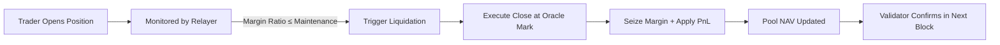

# Margin & Liquidations

> **Audience:** Traders, LPs, and risk managers who want to understand how margin, leverage, and liquidation logic operate on Twilight.
>
> **Goal:** Explain how collateral requirements, leverage, and liquidations work in the Twilight perpetual system — and how these impact both traders and liquidity providers.

***

### 1. Overview

Twilight uses an **isolated-margin model**.\
Each position a trader opens is backed by its own locked margin amount and is **completely independent** from other open trades.

* There are **no margin calls** or cross-collateral contagion.
* If a position reaches its maintenance threshold, it is **immediately and fully liquidated** at the oracle mark (Binance mid-price in the testnet).
* Margin can **not** be topped-up post-execution — traders must close and reopen to resize.

This system simplifies risk management for both traders and the pool by ensuring each trade is self-contained.

***

### 2. Margin Model

| Parameter              | Description                                                                                                |
| ---------------------- | ---------------------------------------------------------------------------------------------------------- |
| **Isolated Margin**    | Margin is locked per trade; no shared exposure.                                                            |
| **Leverage Range**     | Traders can choose **1x–50x** leverage.                                                                    |
| **Margin Selection**   | Trader selects margin and leverage; the system computes required maintenance margin and position notional. |
| **Dynamic Thresholds** | The maintenance margin adjusts with position size and the prevailing funding rate.                         |

Once submitted, margin and leverage become immutable for that trade until closed.

***

### 3. Leverage & Maintenance Margin

When a trader opens a position, the system calculates:

* **Initial Margin (IM)** — collateral required to open the position.
* **Maintenance Margin (MM)** — minimum margin required to keep the position open.

```
MaintenanceMargin = (0.004 × PositionSize)
                  + (fee% × BankruptcyValue)
                  + (funding% × BankruptcyValue)
```

Where:

* 0.004 represents a base 0.4% buffer of the position size.
* fee% and funding% incorporate expected settlement and skew-compensation costs.
* BankruptcyValue corresponds to the mark-to-bankruptcy PnL for that position.

This ensures that liquidation happens before the position’s value becomes negative to the pool.

#### Example

If a trader opens a 1 BTC position at $100 000 USD notional:

```bash
MM = (0.004 × 1 BTC) + (0.0004 × 1 BTC) + (0.0002 × 1 BTC)
MM = 0.0046 BTC
```

Hence, if the trader’s collateral falls below 0.0046 BTC, liquidation is triggered automatically.

***

### 4. Liquidation Triggers

Liquidation occurs when:

```
MarginRatio = (AccountEquity / PositionNotional) ≤ MaintenanceThreshold
```

* The Relayer continuously monitors all open positions.
* Once triggered, a liquidation signal is issued.
* The Validator verifies and finalizes the event in the next block through zkOS proof verification.

No grace period or partial liquidation — the position is fully closed at the current oracle mark.

***

### 5. Execution & Settlement

When liquidation is triggered:

1. The position is closed at the latest oracle mark (Binance mid).
2. The trader’s entire posted margin is seized.
3. The resulting PnL (positive or negative) and margin are settled directly to Pool NAV.

Settlement is confirmed at the block level since new UTXOs are created and validated as part of the zkOS state transition.

***

### 6. Liquidation Outcomes

| Scenario                       | Margin Seized      | Pool Result                                         | Trader Result                                |
| ------------------------------ | ------------------ | --------------------------------------------------- | -------------------------------------------- |
| Position had unrealized profit | Yes                | Pool pays PnL, keeps margin; small loss to pool NAV | Trader loses both margin and unrealized gain |
| Loss < margin                  | Yes                | Pool collects trader loss + remaining margin        | Trader loses more than market loss           |
| Loss > margin                  | Yes (insufficient) | Pool absorbs deficit                                | Trader’s loss capped at margin amount        |

All seized margin, fees, and funding transfers flow to the Twilight Pool, which redistributes this back to LPs through pool accounting.

***

### 7. Risk Management Features

| Mechanism                   | Description                                                                           |
| --------------------------- | ------------------------------------------------------------------------------------- |
| Immediate Full Liquidation  | Eliminates cascading margin calls and simplifies accounting.                          |
| Oracle-based Settlement     | No AMM slippage; execution at trusted external mark.                                  |
| zkOS Verification           | Ensures liquidations are provably valid and non-malicious.                            |
| No Partial Liquidations     | Simplifies protocol flow and preserves deterministic accounting.                      |
| Top-Up SLAs (for LPs)       | Ensure that utilization remains below critical thresholds.                            |
| No Insurance Fund (Testnet) | Deficits are absorbed by Pool NAV. Treasury/insurance will be introduced for mainnet. |

### 8. Liquidation Flow Diagram



***

### 9. Key Takeaways

* Twilight uses isolated per-position margining for deterministic liquidation handling.
* Liquidations are immediate, full, and oracle-priced — no slippage, no partials.
* The pool absorbs excess losses, but gains from fees and funding compensate over time.
* Traders benefit from predictable leverage mechanics; LPs earn from orderly settlement.

***
