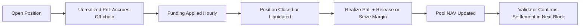

# PnL & Settlement

> **Audience:** Traders and liquidity providers who want to understand how Twilight calculates, tracks, and settles profits and losses (PnL).\
> **Goal:** Explain how trader positions generate BTC-denominated PnL, how settlement works, and how these flows impact pool value (NAV).

***

### 1. Overview

Twilight uses an **inverse BTC-USD perpetual model**.\
All PnL, margin, and accounting are denominated in **SATS (BTC units)**.

* Price feeds come from the external **Binance spot mid-price** (updated every 0.5 s).
* PnL is calculated in BTC, even though notional values are in USD.
* Settlement occurs atomically when a position **closes manually or is liquidated**.
* There is **no streaming PnL** — unrealized PnL is computed off-chain and applied only at close.

***

### 2. PnL Model

Twilight’s PnL model follows standard inverse-perpetual math, expressed in BTC units.

#### Unrealized PnL

For **long positions**:

```
uPnL (BTC) = PositionSize × (1/EntryPrice - 1/ExitPrice)
```

For short positions:

```
uPnL (BTC) = PositionSize × (1/ExitPrice - 1/EntryPrice)
```

Where:

| Variable     | Meaning                                                                     |
| ------------ | --------------------------------------------------------------------------- |
| PositionSize | Contract size in BTC (notional ÷ mark price).                               |
| EntryPrice   | Price at which the position opened.                                         |
| ExitPrice    | Current oracle mark (for unrealized PnL) or close price (for realized PnL). |

Positive PnL increases trader equity; negative PnL reduces it.

Since this is an inverse contract, price movements affect BTC collateral non-linearly as USD prices change.

***

### 3. Position Lifecycle

<br>

Each position in Twilight is isolated — it has its own margin, leverage, and lifecycle.

Here’s how the system tracks and settles PnL:

1.  Open:

    Trader posts margin → position notional and leverage calculated.
2.  Hold:

    Unrealized PnL computed off-chain (via relayer) as price updates.

    Hourly funding adjustments accrue in memory.
3.  Close (manual or liquidation):

    PnL realized, margin released or seized.
4.  Settle:

    Pool NAV and trader account updated atomically at block level (verified via zkOS).

***

### 4. Funding Integration

<br>

Hourly funding rate transfers are applied at the time of settlement.

These compensate the pool for directional skew (as explained in Fees & Funding).<br>

```
skew_raw = (L_usd - S_usd) / (L_usd + S_usd)
rate_hr  = (skew_raw^2 / (ψ * 8)) * sign(skew_raw)
```

At position close:

* If funding was positive, longs pay and shorts receive.
* If funding was negative, shorts pay and longs receive.
* Any residual difference flows to Pool NAV, rewarding LPs.

***

### 5. Settlement Mechanics

<br>

Settlement finalizes all economic transfers in one atomic block event.

<br>

#### For Traders

* PnL realized in BTC (SATS) using the oracle mark at close.
* Margin + PnL returned to the trader’s funding account.
* If position was liquidated, full margin is forfeited.

<br>

#### For the Pool (LPs)

* Losing positions: Margin and losses accrue to Pool NAV.
* Winning positions: Pool pays out trader PnL from its collateral.
* Funding + Fees: Always flow into the pool to offset trader profits.

<br>

Settlement is validated through zkOS proofs ensuring state correctness and privacy.

***

### 6. Example Calculations

<br>

#### Example 1 – Long Position

<br>

A trader opens a 1 BTC long at $40 000, closes at $42 000:

```
PnL = 1 × (1/40000 - 1/42000)
PnL = +0.00000119 BTC  (≈ 119 SATS)
```

If the position had 50× leverage, the initial margin ≈ 0.02 BTC,

so the realized return is \~0.6 %.

***

#### Example 2 – Short Position

<br>

A trader opens a 1 BTC short at $42 000, closes at $40 000:

```
PnL = 1 × (1/40000 - 1/42000)
PnL = +0.00000119 BTC  (≈ 119 SATS)
```

The same magnitude applies — direction determines sign.

***

### 7. Pool Accounting & NAV Adjustments

<br>

After every settlement, the pool’s BTC balance is updated as:

```
Pool NAV = TVL - TTM + Σ(RealizedPnL + Funding + Fees)
```

Where:

| Variable       | Description                                                    |
| -------------- | -------------------------------------------------------------- |
| TVL            | Total LP deposits.                                             |
| TTM            | Total trader margin locked.                                    |
| RealizedPnL    | Sum of all closed trade PnLs (positive or negative).           |
| Funding / Fees | Hourly skew compensation and trading fees flowing to the pool. |
|                |                                                                |

This ensures pool solvency and LP transparency.

In the testnet, withdrawals are instantaneous and reflect updated NAV per block.

***

### 8. Settlement Flow Diagram



***

### 9. Quick Reference — PnL Signs & Effects

| Action      | Market Move     | Trader Outcome           | Pool Effect                 | Notes                        |
| ----------- | --------------- | ------------------------ | --------------------------- | ---------------------------- |
| Open Long   | Price ↑         | Trader profit (BTC gain) | Pool pays PnL               | Funding rate may reduce bias |
| Open Long   | Price ↓         | Trader loss (BTC loss)   | Pool collects margin + loss | —                            |
| Open Short  | Price ↓         | Trader profit (BTC gain) | Pool pays PnL               | —                            |
| Open Short  | Price ↑         | Trader loss (BTC loss)   | Pool collects margin + loss | —                            |
| Liquidation | Margin ≤ MM     | Trader loses all margin  | Pool absorbs PnL impact     | Verified per block           |
| Funding > 0 | Long-heavy skew | Longs pay shorts / pool  | LPs earn from skew          | Applied hourly               |

### 10. Key Takeaways

* PnL is BTC-denominated — every trade result settles in SATS.
* Each position is independent and settles atomically on close.
* Funding and fees integrate seamlessly into final PnL.
* All accounting verified via zkOS proofs for on-chain integrity.
* Pool NAV automatically adjusts — keeping LP exposure accurate.

***
